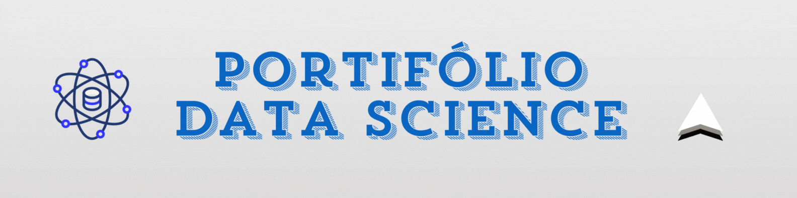

  
<h1 align="center">Hi 👋, I'm Oséias</h1>

<!-- 

   

-->

<h3 align="center">Electrical engineering student from Brazil</h3>

<h3 ><a href="https://www.youtube.com/@pythonaltas" target="_blank"> Meu Canal no YouTube [ Pythonaltas 🚀 ]</a></h3>

<h3 ><a href="https://oseiasfarias.medium.com" target="_blank"> Posts Recentes Medium </a></h3>

<ul>
    <li><a href="https://oseiasfarias.medium.com/p1-estat%C3%ADstica-para-ci%C3%AAncia-de-dados-a1949514b4ee">Medidas de Tendência Central — Estatística para Ciência de Dados
</a></li>
    <li><a href="https://oseiasfarias.medium.com/salvar-e-carregar-modelos-de-machine-learning-treinados-usando-a-biblioteca-scikit-learn-cb61a8c99348">Salvar e Carregar Modelos de Machine Learning Treinados Usando a Biblioteca Scikit-Learn
</a></li>
    <li><a href="https://medium.com/p/be42cea47a6c">Boxplot com Python usando Matplotlib e Seaborn
</a></li>
    <li><a href="https://oseiasfarias.medium.com/estrutura-do-matplotlib-pyplot-figure-axes-e-axis-1a45295cb7d3">Estrutura do matplotlib.pyplot (Figure, Axes e Axis)
</a></li>
</ul>

<!-- 
### GitHub Stats

  
 -->

<h3 align="center">Connect with me:</h3>

  

## My Skill Set  
<table><tr><td valign="top" width="33%">

### Data Science  

  
                    

</td><td valign="top" width="33%">

### Backend  

   

  
    
        
 
 

 
  
 

</td><td valign="top" width="33%">

### Programming Tools 

  

 
 
 
   
   

</td></tr></table>   

 

## &#x1f4c8; GitHub Stats

<!-- SNAKE INIT -->

    

 
<!-- SNAKE END -->

<!-- icons with padding -->

[1.1]: http://i.imgur.com/tXSoThF.png (twitter icon with padding)
[2.1]: http://i.imgur.com/0o48UoR.png (github icon with padding)

<!-- icons without padding -->

[1.2]: http://i.imgur.com/wWzX9uB.png (twitter icon without padding)
[2.2]: http://i.imgur.com/9I6NRUm.png (github icon without padding)
[3.2]: https://raw.githubusercontent.com/MartinHeinz/MartinHeinz/master/linkedin-3-16.png (LinkedIn icon without padding)

<!-- links to your social media accounts -->

[1]: https://twitter.com/Martin_Heinz_
[2]: https://github.com/MartinHeinz
[3]: https://www.linkedin.com/in/heinz-martin/

<!-- Resources -->
<!-- Icons: https://simpleicons.org/ -->
<!-- GitHub Stats: https://github.com/anuraghazra/github-readme-stats -->
<!-- Emojis: https://emojipedia.org/emoji/ -->
<!-- HTML Emojis: https://www.fileformat.info/index.htm -->
<!-- Shields: https://shields.io/ -->
<!-- Awesome GitHub Profile README: https://github.com/abhisheknaiidu/awesome-github-profile-readme -->
